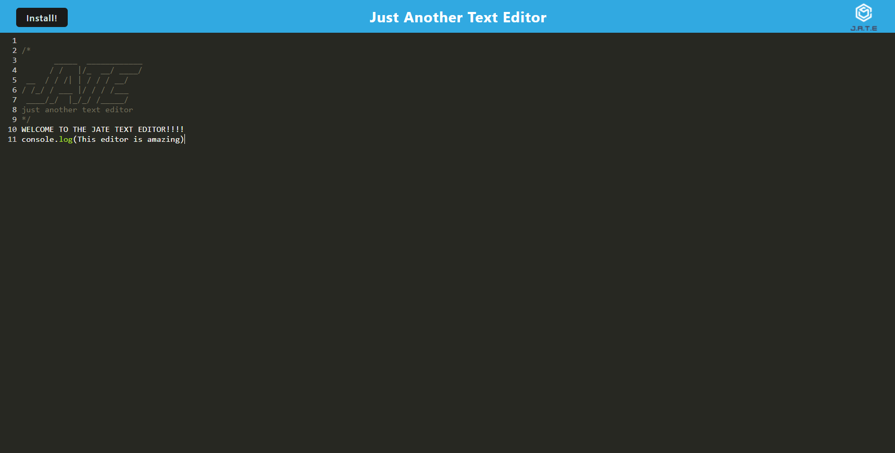
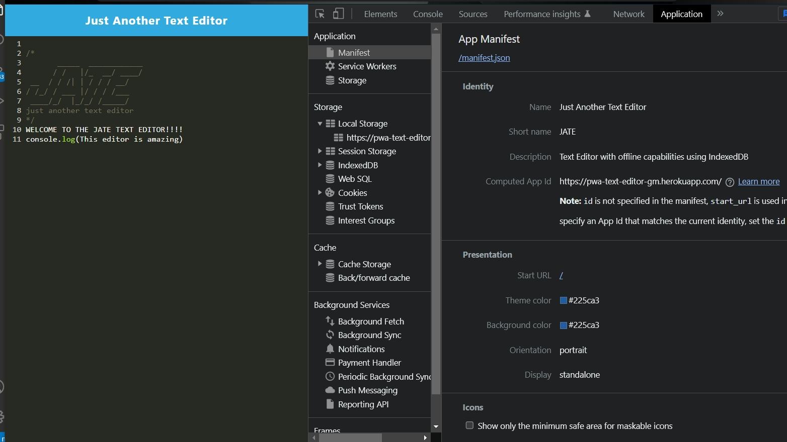
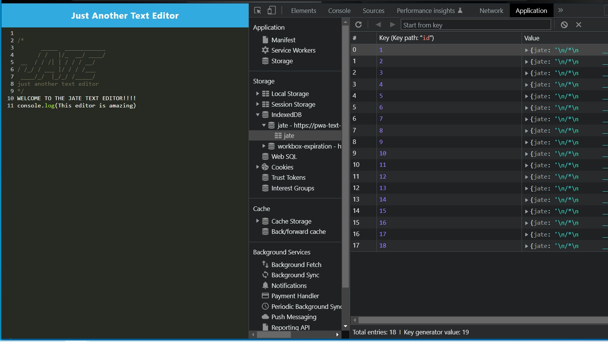
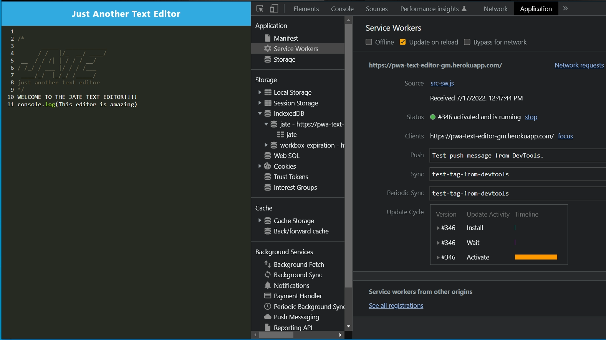

# J.A.T.E. - Just Another Text Editor

## Table-of-Contents

- [Description](#description)
- [Installation](#installation)
- [Usage](#usage)
- [Contributing](#contributing)
- [Tests](#tests)
- [License](#license)
- [Questions](#questions)

## [Description](#table-of-contents)

J.A.T.E. is a PWA (Progressive web Application) text editor that runs in a user's browser and it also has offline funtionality with the ability to install the application on a user's computer. 

This application utilizes express, if-env, nodemon, concurrently, babel-loader, css-loader, html-webpack-plugin, style-loader, http server, webpack dependencies, workbox, and manifest.

## [Installation](#table-of-contents)

A user must `git clone` this repository. Onced the repository is cloned, a user will have to run `npm install` from the command line in order to install all the dependencies. Finally, the user will run `npm run start:dev` to finish build and installation. 

## [Usage](#table-of-contents)

From the command line in the terminal, a user can type `npm run start` to open the J.A.T.E. text editor in their browser utilizing their local host http://localhost:3000/. The application is also deployed using Heroku. 

### **Link to deployed Heroku application:**
https://pwa-text-editor-gm.herokuapp.com/

### **Screenshots of the J.A.T.E. Text Editor:**

## [Contributing](#table-of-contents)

Contributors can see installation instructions or contact me with the information below.

## [Tests](#table-of-contents)

There are no tests for this application.

## [License](#table-of-contents)

## [Questions](#table-of-contents)

If you have any questions about this project, please contact me using the following links:

[GitHub](https://github.com/Gregm316)

[Email: gregm316@gmail.com](mailto:gregm316@gmail.com)
